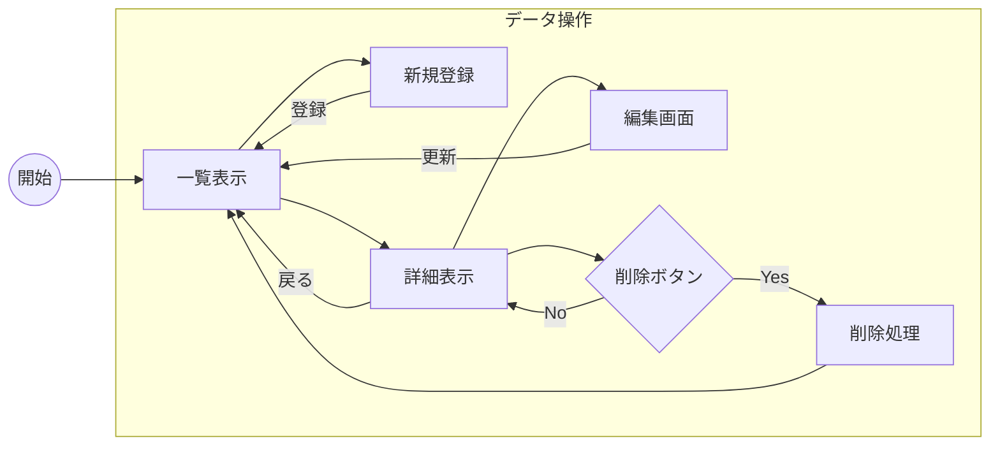
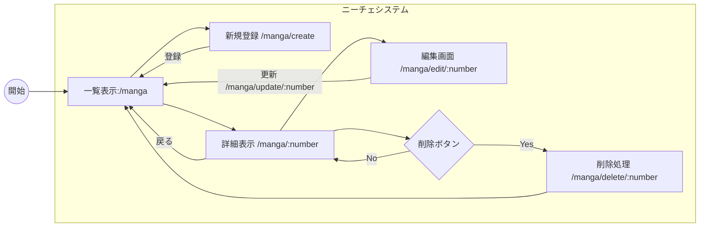

<!-- ・データ構造
・ページ遷移
  どうやってページ遷移するか？（ページ内のリンク，駅名をクリックなど）
  HTTPメソッドとリソース名
  追加・削除・編集後に表示する内容
・リソースごとの機能の詳細 -->

# 開発者用仕様書(仮)
更新がされないめう

本開発者用仕様書では，提供する3つのシステムに関するデータ構造，ページ遷移ならびにリソースごとの機能について説明を行う．

## システムの概要
提供するシステムとして，
・

## 目的

## データ構造
本システムにおけるデータ構造を表に示す．

### ニーチェが京都にやってきて17歳の私に哲学のことを教えてくれた。
項目名 | 型 | 内容 
-|-|- 
name| 文字列 | 登場人物
birth | 数値 | 生誕
death | 数値 | 死没
intro | 文字列 | 概要
thought | 文字列 | 主な思想
book | 文字列 | 著作物
story | 文字列 | 登場話

・登場人物は漫画に登場してきた順番に紹介している．
・概要では，漫画の世界観における人物紹介や設定について紹介している．
・主な思想では，本システムでは漫画で取り上げられている概念や思想を中心として紹介している．また，解説も漫画を基に初学者にもわかりやすい表現を用いている．
・著作物では，日本語訳がされている作品を中心として，発行年順に並べている．

### 教育原理で登場する主要な教育思想家一覧

項目名 | 型 | 内容 
-|-|- 
name| 文字列 | 人物
birth | 数値 | 生誕
death | 数値 | 死没
book | 文字列 | 著作物
study | 文字列　| 教育への影響
key | 文字列　| 関連するキーワード

・関連するキーワードとは，日本の教育において重要視される思想や考え方を示している．

### 佐藤の推しキャラ(抜粋)の一覧

項目名 | 型 | 内容 
-|-|- 
name| 文字列 | 人物
month | 数値 | 生誕月
day | 数値 | 生誕日
sintyou | 数値 | 身長
taijuu | 数値 | 体重
ti | 文字列　 | 血液型
seiza | 文字列 |　星座
anime | 文字列 | 作品名
belong | 文字列　|所属
intro | 文字列　|人物紹介
family | 文字列　| 家族構成
hobby | 文字列　| 趣味
skill | 文字列 | 特技
like | 文字列　| 好物
cast | 文字列 | 声優
akusuta | 数値　|所持しているアクリルスタンド数
kanba | 数値　| 所持している缶バッチ数
key | 数値　| 所持しているキーホルダー全般
posuta | 数値　|　所持しているポスター
fig | 数値　| 所持しているフィギュア

・クリアファイルは引っ張り出すのが面倒なので今回は除外した
・身長や体重など，公式から発表されていない項目においては0か-と記入している

<!-- ### ダンガンロンパ
はじめに，ダンガンロンパ攻略システムにおけるデータ構造について下記の表に示す．

項目名 | 型 | 内容 
-|-|- 
char | 文字列 | 登場人物
birth | 数値 | 誕生日
cast | 文字列 | 声優
title | 文字列 | 登場人物の肩書
end | 文字列 | そのキャラの結末
<!-- chapter | 数値 | チャプター
day | 数値　| (非)日常編
evidence | 文字列 | 必要となる証拠
place | 文字列 | 証拠がある場所
trial | 数値　| 学校裁判
choice | 文字列　| 選択肢の解答
discuss | 文字列 | 指摘する言葉(言弾)
write | 文字列 |　入力する言葉(閃きアナグラム) -->
<!-- punishment | 文字列 | 処刑内容(おしおき) -->

<!-- ### NEEDY GIRL OVERDOSE
次に，NEEDY GIRL OVERDOSE攻略システムにおけるデータ構造について下記の表に示す．

項目名 | 型 | 内容 
-|-|-
character | 文字列 | 登場人物
birth | 数値 | 誕生日
cast | 文字列 | 声優
chara_detail | 文字列　| 登場人物紹介
ending | 文字列 |　エンディング名
followers | 数値 | フォロワー数
like | 数値 | 好感度
dislike | 数値　| やみ度
other | 文字列 | その他分岐を踏むための条件 -->

<!-- ### ファミレスを享受せよ
最後に，ファミレスを享受せよ攻略システムにおけるデータ構造について下記の表に示す．

項目名 | 型 | 内容 
-|-|-
character | 文字列 | 登場人物
chara_detail | 文字列　| 登場人物紹介
ending | 文字列 |　エンディング
route | 文字列 | 分岐箇所
route_detail | 文字列 | 選択肢を選んだ際に取得できるもの
other | 文字列 | 間違い探しの解答

 -->

## ページ遷移
本システムにおけるページ遷移について説明を行う．

ページの遷移の仕方に関しては登場人物の名前やエンディングの名前をクリックする方式を採用する．また，ページ遷移案を下記のフローチャートに示す．本システムで紹介する作品は、マルチエンディングと呼ばれる種類であり，またプレイヤーによる選択により異なる会話やアイテムを取得できる．そのため，分岐する場所がわかるよう，ストーリー一覧では時系列順に出力されるようにし，分岐する箇所をクリックすることにより分岐ルート詳細へとページが遷移する．

・ニーチェ

機能 | メソッド | リソース名  
-|-|-
一覧 | get | /manga
詳細表示 | get　| /manga/:number
新規登録 | get |　/manga/create 
削除 | get | /manga/delete/:number
編集 | get  | /manga/edit/:number
更新 | post | /manga/update/:number

・教育原理

機能 | メソッド | リソース名  
-|-|-
一覧 | get | /kyouiku
詳細表示 | get　| /kyouiku/:number
新規登録 | get |　/kyouiku/create 
削除 | get | /kyouiku/delete/:number
編集 | get  | /kyouiku/edit/:number
更新 | post | /kyouiku/update/:number

    

具体的なメソッド名やリソース名に関して，現在検討中であるため割愛する．

## リソースごとの機能の詳細
ページ遷移と同様．

